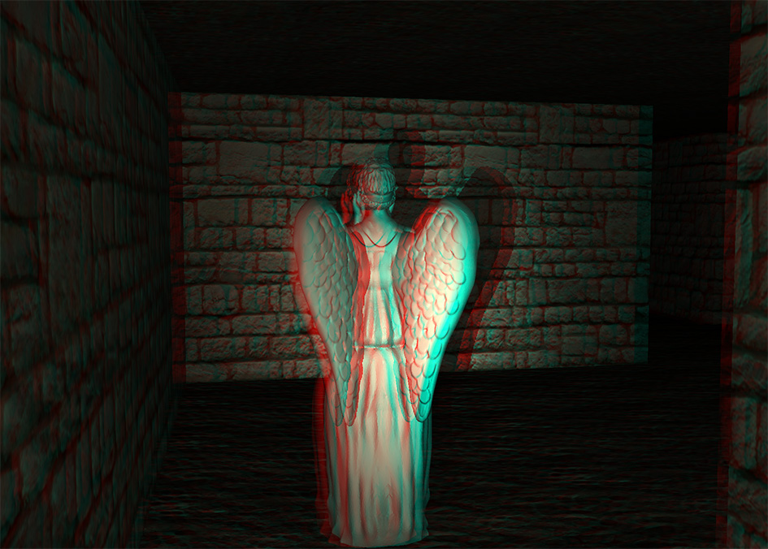

# Weeping Angels

This is a final project I built for a graphics course. Explore a procedurally generated dungeon filled with weeping angels.



## Features

- Shadow mapping
- Normal-mapped textures
- Stereo anaglyph rendering
- Procedurally generated dungeon
- Collision detection with walls and objects
- Basic AI for enemies

## Building

GLFW3 is required. A binary for macOS is included in the repo.

The CMake was only tested macOS. The libraries may need to be modified on other platforms.

To build on macOS:
```
mkdir build
cd build
cmake ..
cmake --build . --target install
```

## Controls

Click on window to capture mouse for free look

- *W*/*A*/*S*/*D* - move
- *Q* - toggle lighting
- *E* - toggle no-clip mode
- *R* - re-generate dungeon
- *0* - wireframe mode

## Authors

Trevor Smith - [LinkedIn](https://linkedin.com/in/trevorsm/)
